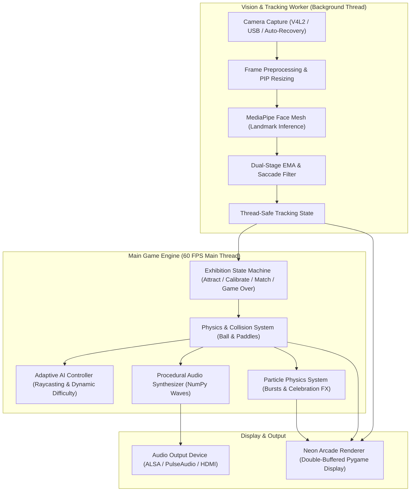

# FacePong

> Interactive arcade Pong powered by real-time computer vision and adaptive artificial intelligence. Designed for interactive public exhibitions and single-board embedded systems (Raspberry Pi 4 / 5).

[](https://www.python.org/)
[](LICENSE)
[]()
[](https://audacia.unisimon.edu.co/)

**FacePong** delivers a contactless arcade experience where the player guides their paddle using head position and subtle facial gestures. The opponent is driven by an **Adaptive Artificial Intelligence** agent that continuously calibrates its reaction latency, prediction accuracy, and motor error against the live scoreline and shot dynamics, ensuring matches remain engaging, challenging, and winnable for casual and seasoned players alike.

---

## Core Capabilities

- **Hands-Free Facial Landmark Control**: High-precision head tracking utilizing MediaPipe Face Mesh (glabella/nasal root tracking). Features dual-stage motion filtering: instantaneous linear tracking for rapid, reflexive head maneuvers combined with dynamic Exponential Moving Average (EMA) dampening for subtle micro-adjustments.
- **Dynamic Difficulty Adjustment (DDA)**: The AI opponent computes multi-bounce wall reflections using geometric raycasting. Intentional error margins scale realistically with shot difficulty: trivial serves are returned consistently, while sharp angled cuts and high-speed smashes challenge the AI and reward skilled player shots.
- **Autonomous Kiosk State Machine**: Self-contained lifecycle management (`ATTRACT` &rarr; `CALIBRATION` &rarr; `MATCH` &rarr; `GAME OVER`). Includes an **Inactivity Watchdog** that monitors player presence and gracefully resets unattended games back to attract mode.
- **Retro-Futuristic Neon Aesthetic**: Real-time glow shaders, dynamic particle physics (goal bursts, celebratory victory fountains), cybernetic camera picture-in-picture (PIP) with facial wireframe overlay, and custom arena bezel layout.
- **Zero-Asset Procedural Audio**: Integrated real-time sound synthesizer powered by NumPy waveform generation, producing arcade blips, wall reflections, goal explosions, and victory fanfares without external audio asset files.
- **Dynamic Camera Hot-Plugging**: Robust multi-camera probing that prioritizes external USB cameras over integrated webcams, auto-recovers from disconnections, and switches capture streams on the fly without game interruption.
- **Embedded Hardware Optimization**: Multithreaded decoupling between the 60 FPS Pygame render loop and asynchronous camera inference workers, ensuring fluid gameplay on Raspberry Pi 4 and 5 hardware.

---

## Architecture Overview

FacePong is architected around decoupled, concurrent subsystems that segregate video frame acquisition and deep-learning inference from the deterministic physics and rendering loop:



### Subsystem Breakdown

1. **Vision Pipeline (`facepong.vision`)**:
   - `camera.py`: Asynchronous camera capture worker managing hardware frame buffers with V4L2 backend support, hot-plug detection, and graceful device fallback.
   - `tracker.py`: Tracks 3D facial landmarks, applies dual-stage motion stabilization, performs dynamic baseline auto-anchoring, and generates HUD wireframe contours.
2. **Game Systems (`facepong.game`)**:
   - `engine.py`: Master controller driving delta-time synchronization, input event loops, and game lifecycle state transitions.
   - `ai.py`: Predictive trajectory raycasting with dynamic shot-difficulty error modulation and human-like reaction latency.
   - `entities.py`: Deterministic entity physics for paddle motion (SmoothDamp), multi-bounce ball collisions, and collision particle emissions.
   - `audio.py`: Pure mathematical waveform generation (square, sine, and frequency chirps) mapped directly to Pygame sound channels.
   - `state.py`: Exhibition state machine handling timeouts, scoring, rally statistics, and win condition triggers.
3. **User Interface (`facepong.ui`)**:
   - `renderer.py`: Optimized neon glow rendering, outer arena borders, dynamic bloom effects, and diagnostic HUD overlays.
   - `screens.py`: Standalone visual scenes for attract kiosk mode, calibration countdowns, goal banners, and post-match victory cards.

---

## Hardware & System Requirements

### Recommended Hardware
- **Single-Board Computer**: Raspberry Pi 4 (4 GB / 8 GB) or Raspberry Pi 5.
- **Display**: HDMI monitor or television (720p or 1080p resolution).
- **Camera**: Standard USB webcam (e.g., Logitech C270, C920, or generic 1080p USB camera) or Raspberry Pi Camera Module v2 / v3.
- **Audio Output**: HDMI audio or 3.5 mm analog stereo jack.

*FacePong is fully cross-platform and executes identically on Linux, macOS, and Windows workstations.*

### Software Prerequisites
- Python 3.10 or 3.11
- Raspberry Pi OS (64-bit Bookworm recommended) or modern Linux distribution

---

## Installation

### 1. Clone Repository
```bash
git clone https://github.com/AudacIA/FacePong.git
cd FacePong
```

### 2. Configure Virtual Environment
```bash
python3 -m venv .venv
source .venv/bin/activate
```

### 3. Install Dependencies
```bash
pip install -r requirements.txt
```

---

## Usage

### Standard Launch
Run FacePong with automatic hardware detection:
```bash
python3 main.py
```

### Kiosk Exhibition Mode
For public installations and fullscreen exhibition stands:
```bash
python3 main.py --fullscreen
```

### Command-Line Arguments

| Argument | Type | Default | Description |
| :--- | :--- | :--- | :--- |
| `--width` | integer | `1280` | Target display width in pixels |
| `--height` | integer | `720` | Target display height in pixels |
| `--fullscreen` | flag | `False` | Run in borderless fullscreen mode |
| `--camera` | integer | `None` | Device index override (defaults to auto-detecting USB cameras) |
| `--cam-width` | integer | `640` | Camera capture width |
| `--cam-height` | integer | `480` | Camera capture height |
| `--alpha` | float | `0.32` | Base EMA smoothing coefficient for head tracking |
| `--sensitivity` | float | `3.6` | Head vertical motion sensitivity multiplier |
| `--timeout` | float | `5.0` | Inactivity watchdog timeout in seconds |
| `--win-score` | integer | `5` | Score target to conclude a match |
| `--no-sound` | flag | `False` | Disable procedural audio synthesis |
| `--debug` | flag | `False` | Enable diagnostic overlay (FPS, AI telemetry, tracking data) |
| `--log-level` | string | `INFO` | Logging verbosity (`DEBUG`, `INFO`, `WARNING`, `ERROR`) |

---

## Controls & Exhibition Flow

| Input | Function |
| :--- | :--- |
| **Head Pitch (Up / Down)** | Primary gameplay control: moves player paddle along vertical axis |
| **W / S** or **Up / Down Arrows** | Manual keyboard override for accessibility and testing |
| **Spacebar** | Instantly start match from attract mode or skip countdown screens |
| **D** | Toggle real-time diagnostic performance HUD |
| **Escape** | Gracefully terminate the application |

### Match Lifecycle

1. **Attract Mode**: Displays high-contrast cyber visuals, gameplay previews, and pulsing callouts inviting visitors forward.
2. **Presence Detection & Calibration**: When a user is detected, a 3-second neutral face calibration locks their baseline resting position.
3. **Competitive Match**: First to 5 points. The AI balances its defense so that well-placed shots score while casual rallies remain accessible.
4. **Presence Watchdog**: If a player leaves mid-game, an on-screen warning initiates a 5-second countdown before resetting to attract mode.
5. **Game Over & Summary**: Displays match statistics (rallies, scores, duration) alongside victory effects before returning to title state.

---

## Performance Optimization (Raspberry Pi)

To optimize frame rates and CPU efficiency on Raspberry Pi installations:

1. **GPU Memory Split**: Allocate a minimum of 128 MB to the GPU via `raspi-config`:
   ```bash
   sudo raspi-config
   # Performance Options -> GPU Memory -> 128
   ```
2. **Display Scaling**: Keep game rendering at 720p (`1280x720`), which strikes the ideal balance between high-fidelity visuals and 60 FPS performance on embedded VideoCore GPUs.
3. **Kiosk Autostart**: To configure automatic startup upon system boot:
   ```bash
   mkdir -p ~/.config/autostart
   cat << 'EOF' > ~/.config/autostart/facepong.desktop
   [Desktop Entry]
   Type=Application
   Name=FacePong
   Exec=/bin/bash -c "source /home/pi/FacePong/.venv/bin/activate && python3 /home/pi/FacePong/main.py --fullscreen"
   Terminal=false
   EOF
   ```

---

## Testing & Quality Assurance

The codebase includes comprehensive unit tests verifying physics, AI difficulty curves, state transitions, and vision pipeline stability:

```bash
python3 -m unittest discover tests
```

---

## License

FacePong is licensed under the [Apache License 2.0](LICENSE).
